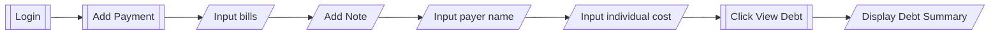
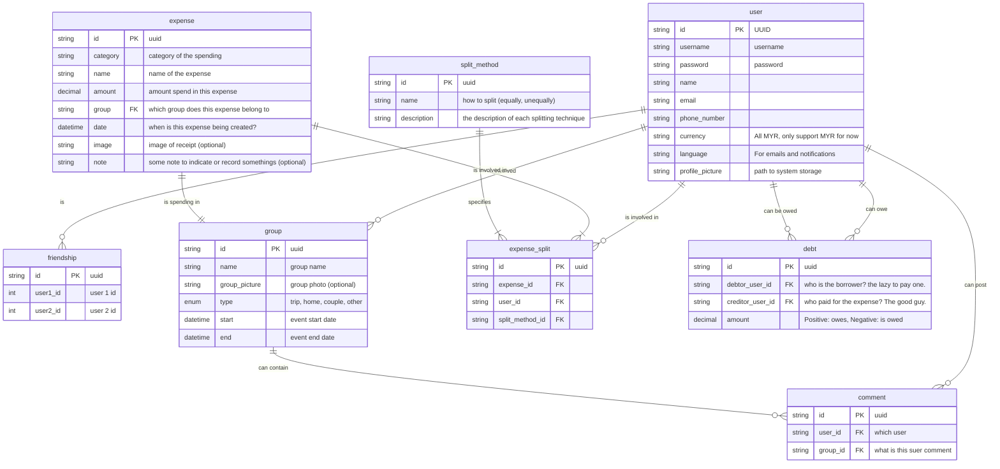

# Bill Management System (BMS)

This project originated from a problem I faced while on vacation with friends. During one of my recent trips, we encountered difficulties in keeping track of who paid for which bills, resulting in confusion and uneven expenses where some individuals paid for certain items while others paid for others.

## Problems

Ali, Ah Chong, and Mei Mei went on a vacation in Kuala Lumpur. For breakfast, Ali spent RM 10, Ah Chong spent RM 14, and Mei Mei spent RM 6. Mei Mei helped pay for the bill, which came to a total of RM 30.

Later that night, they had dinner at a fancy restaurant. Ali's meal cost RM 35, Ah Chong's cost RM 30, and Mei Mei's cost RM 100. Ali paid for the bill, which came to a total of RM 165.

When they settled the bills, Ali didn't owe anything. Ah Chong owed Mei Mei RM 14 and Ali RM 30. Mei Mei owed Ali RM 90 (RM 100 minus the RM 10 she contributed to the breakfast bill).

## Solution

The BMS system resolved the issue by displaying to each user the amount owed to or by other participants for the entirety of the trip.

## Home Bill Management System

### ERD

