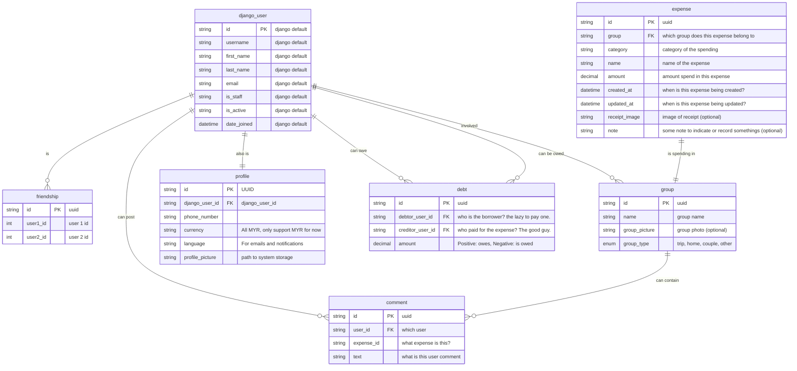

# Bill Management System (BMS)

Something like SplitWise but its open-source.

## ERD

## DJango App

1. User App:
    - Models:
        - User: Extends the default Django User model.
    - Relations:
        - Friendship: Represents a friendship relationship between users.
        - ExpenseSplit: Represents a user's involvement in splitting an expense.
        - Comment: Represents user comments.
        - Debt: Represents debts owed between users.

2. Group App:
    - Models: Group
    - Relations: User (through friendship), Expense, Comment

3. Expense App:
    - Models: Expense, SplitMethod, ExpenseSplit
    - Relations: User (through ExpenseSplit), Group (through Expense)

4. Comment App:
    - Models: Comment

5. Debt App:
    - Models: Debt

## References

1. <https://medium.com/@russell.cecala/full-stack-with-flutter-and-django-rest-framework-16fd666d39b> Get started with django rest framework.
