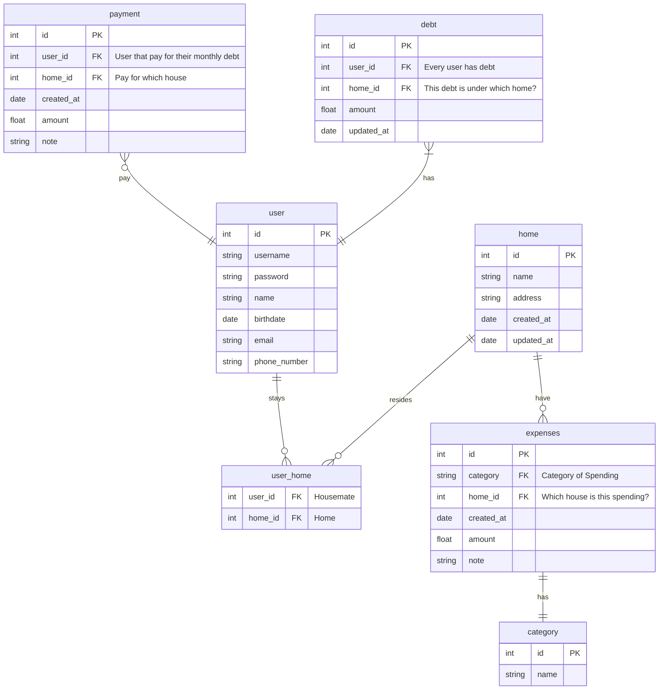

# Bill Management System (BMS)

This project is a problem that I faced during my university time. In our final year, we have to rent outside and find our own housemate. In my case, my housemates are all my classmate which we are very good friends. 

However, friend are friend, we definitely will encounter issue of bill splitment & finance when live together. There are few issues that we face during our stay in one year. 

## Problems:
1. We have a treasurer where every month we have to give RM 100 + rental. RM 100 is mainly use for groceries, utlities and misc spending (dish washer, fans, repair).

<!-- 2. Sometimes, when we dine outside. We have the problem on someone other than tresurer pay ahead for us. He have to keep track everyone cost and wait for them to pay back.  -->

Example: A pay for B, C, D meals ahead. But B, C, and D are having different cost for the meals.

## Solution:

BMS system is a system where its make manage your finance across student as easy as ABC! Just start with register, add bills. 

<!-- There are 2 main function in the app, home bills management and personal bills management. -->

## Home Bill Management System

```PseudoCode
1. Start
2. Register User
    2.1 Home Management Page (Settings for Home) - Settings Page
        2.1.1 Create / Select Home (eg. MH 4/2)
        2.1.1 Send invite to other user
        2.1.2 Set Monthly Contribution for each housemate (Every month need to contribute how much)
        2.1.3 CRUD Category

    2.2 Add expenses
        2.2.1 Add Date
        2.2.2 Add Category
        2.2.3 Add Amount
        2.3.3 Add Note

    2.3. Add Payment
        2.3.1 Add Date
        2.3.2 Add Amount
        2.3.3 Add Note
        2.3.4 Add User (Will be use to deduct their monthly bills contribution)

    2.4 View Debt
        2.4.1 Display housemate that haven't pay
        2.4.2 For user
            2.4.2.1 Able to view when is they pay the house debt

    2.5 View Transaction (Charting and Diagram)
        2.5.1 View monthly transaction
        2.5.2 Edit transaction
``` 

### ERD

