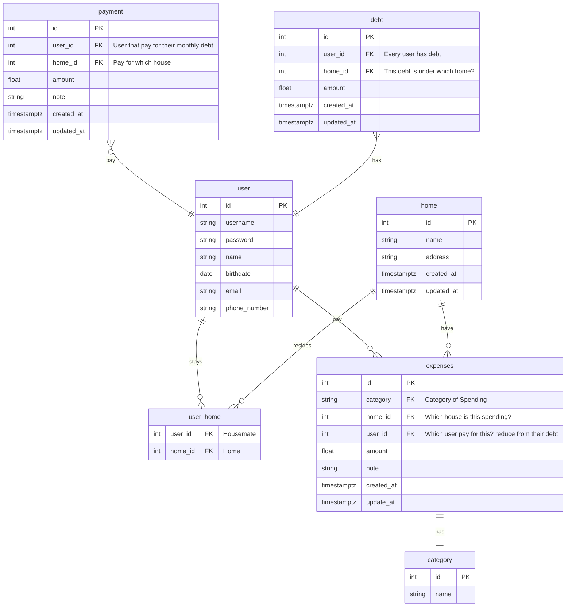

# Bill Management System (BMS)

This project stems from an issue I encountered during my university days. During our final year, we had to rent a place and find our own housemates, who were all my classmates and close friends. 

Despite our strong friendship, we still faced challenges in splitting bills and managing finances while living together. Over the course of one year, we encountered several problems in this area.

## Problems:
1. Our treasurer collected RM 100 from each of us each month, along with the rental. This money was used to pay for groceries, utilities, and various other expenses such as dishwashers, fans, and repairs. However, keeping track of who had already paid was challenging, and the treasurer sometimes had to make adjustments, such as giving refunds, to account for discrepancies in expenses.

<!-- 2. Sometimes, when we dine outside. We have the problem on someone other than tresurer pay ahead for us. He have to keep track everyone cost and wait for them to pay back.  -->

<!-- Example: A pay for B, C, D meals ahead. But B, C, and D are having different cost for the meals. -->

## Solution:

The BMS system is a simple and straightforward solution for managing finances among students. With just a few easy steps, such as registering and adding bills, it makes managing finances as easy as ABC.

<!-- There are 2 main function in the app, home bills management and personal bills management. -->

## Home Bill Management System

```PseudoCode
1. Start
2. Register User
    2.1 Home Management Page (Settings for Home) - Settings Page
        2.1.1 Create / Select Home (eg. MH 4/2)
        2.1.1 Send invite to other user
        2.1.2 Set Monthly Contribution for each housemate (Every months need to contribute how much, some people might contribute less)
        2.1.3 CRUD Category

    2.2 Add expenses
        2.2.1 Add Date
        2.2.2 Add Category
        2.2.3 Add Amount
        2.3.3 Add Note
        2.3.4 Add User that pay

    2.3. Add Payment
        2.3.1 Add Date
        2.3.2 Add Amount
        2.3.3 Add Note
        2.3.4 Add User (Will be use to deduct their monthly bills contribution)

    2.4 View Debt
        2.4.1 Display housemate that haven't pay
        2.4.2 For user
            2.4.2.1 Able to view when is they pay the house debt

    2.5 View Transaction (Charting and Diagram)
        2.5.1 View monthly transaction
        2.5.2 Edit transaction
``` 

### ERD

